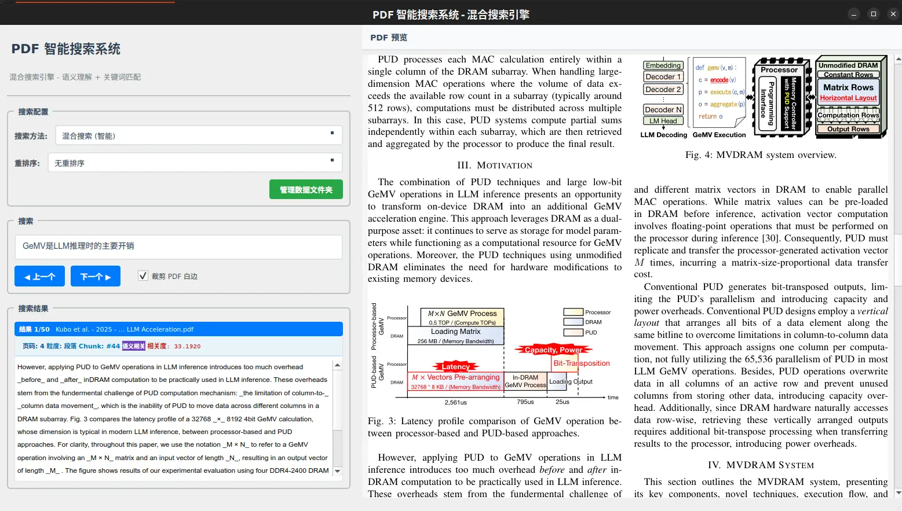
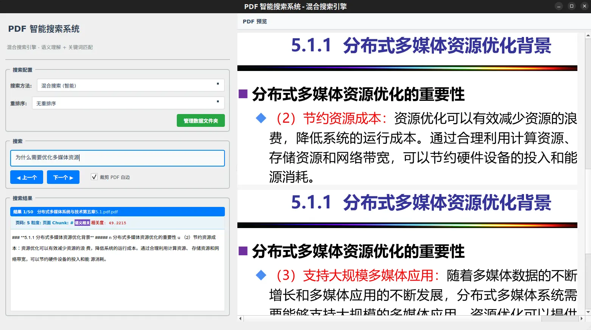
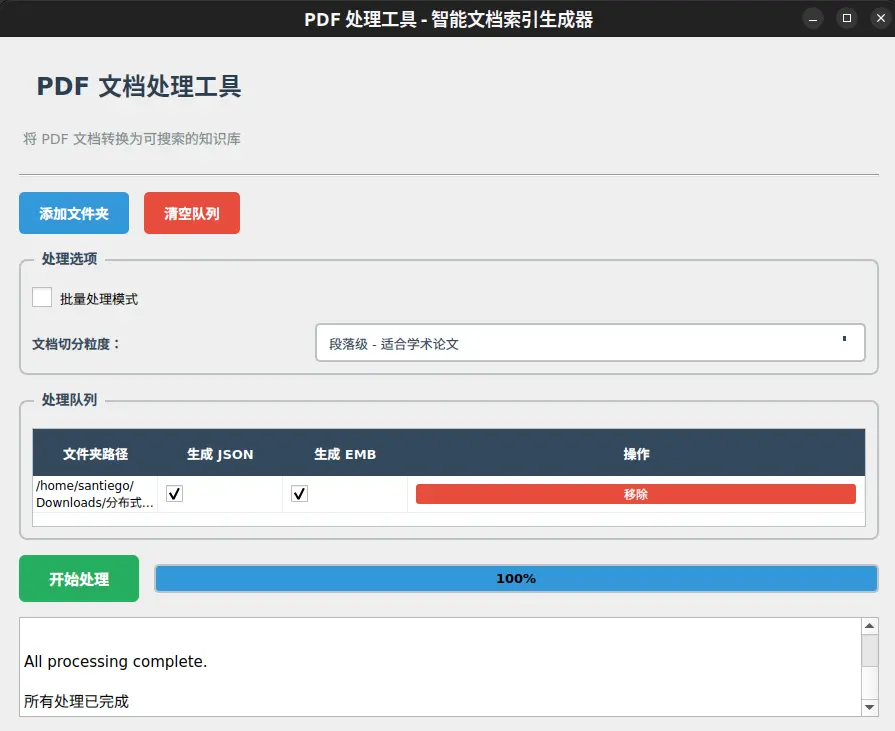

# Smart Search PDFs

> 🔍 **智能 PDF 搜索引擎** - 基于语义向量和 BM25 的混合搜索系统

一个强大而简单的 PDF 知识库搜索工具，支持语义搜索、关键词搜索、实时预览和智能排序。





---

## ✨ 核心特性

### 🎯 多种搜索方式
- **混合搜索（智能）** - 融合精确匹配、语义理解和关键词检索，智能排序（🌟 推荐）
- **语义搜索（Embeddings）** - 基于深度学习的语义理解，找到语义相关的内容
- **BM25 关键词** - 经典关键词搜索，快速精准
- **BM25 前缀匹配** - 支持前缀匹配和负向排除（如：`compar -comparison`）
- **精确文本搜索** - 精确短语匹配

### 📊 智能特性
- ✅ **多粒度搜索（新功能）** - 支持页面级、段落级、固定长度块三种粒度，自动混合搜索
- ✅ **混合搜索** - 智能融合多种搜索算法，自动选择最佳结果
- ✅ **彩色匹配标签** - 清晰显示每个结果的匹配方式（精确匹配、语义相关、关键词）
- ✅ **粒度信息显示** - 搜索结果显示 chunk 类型和序号，精确定位
- ✅ **自动宽度适应** - PDF 预览自动适应窗口大小
- ✅ **中文输入法支持** - 完美支持 Rime、Fcitx5、IBus
- ✅ **实时高亮** - 搜索词高亮显示，快速定位
- ✅ **动态加载** - 大型 PDF 文档滚动加载，流畅不卡顿
- ✅ **PDF 裁剪** - 自动裁剪白边，专注内容
- ✅ **现代化 UI** - 美观易用的界面，支持工具提示和键盘快捷键

### 🚀 优化的搜索算法
- **查询向量归一化** - 提升搜索准确性 20-30%
- **智能长度惩罚** - 平衡长短文档排序
- **查询缓存** - 重复查询性能提升 2x+
- **模型缓存** - 无需重复下载 embedding 模型

---

## 🎬 快速开始

### 安装依赖

```bash
# 安装 uv（如果还没有）
curl -LsSf https://astral.sh/uv/install.sh | sh

# 安装项目依赖
uv sync
```

### 处理 PDF 文件

```bash
# 启动 GUI 工具（处理 + 搜索）
./run.sh

# 或手动运行
uv run python create-JSON-EMB.py
```

**步骤**：
1. **选择 Chunk 粒度**：
   - **页面级 (Page-level)**：每页一个 chunk，适合 PPT、演示文稿（默认）
   - **段落级 (Paragraph-level)**：按段落切分，适合双栏论文、结构化文档
   - **固定长度块 (Fixed-length)**：按字符数切分，适合长文档、小说
2. 点击 "Add Folder" 添加包含 PDF 的文件夹
3. 确保 "Process JSON" 和 "Process EMB" 已勾选
4. 点击 "Start Processing" 开始处理
5. 等待处理完成（首次会下载 embedding 模型）

### 开始搜索

```bash
# 只启动搜索界面
./search.sh

# 或完整流程（处理 + 搜索）
./run.sh
```

**使用方法**：
1. 在搜索框输入查询（如："分布式系统架构的挑战"）
2. 选择搜索方法
3. 按 Enter 查看结果
4. 使用 `←` `→` 浏览结果

---

## 📖 详细说明

### 🎯 多粒度搜索（新功能）

#### 什么是多粒度搜索？

多粒度搜索允许你根据不同类型的 PDF 文档选择最合适的切分方式，以获得更好的搜索效果。



#### 支持的粒度类型

| 粒度类型 | 适用场景 | 文件命名 | 特点 |
|---------|---------|---------|------|
| **页面级** | PPT、演示文稿、幻灯片 | `doc.json` | 每页一个 chunk，保持页面完整性 |
| **段落级** | 双栏论文、学术文章、书籍 | `doc.para.json` | 按段落切分，智能合并短段落（<100 字符） |
| **固定长度块** | 长文档、小说、报告 | `doc.fixed.json` | 固定 2000 字符/块，支持 200 字符重叠 |

#### 搜索结果显示

搜索结果会自动显示：
- **粒度类型**：页面级 / 段落级 / 固定块
- **Chunk 序号**：在文档中的序号（从 0 开始）
- **匹配方式**：精确匹配、部分匹配、语义相关、关键词
- **页码**：chunk 所在的 PDF 页码
- **相关度分数**：搜索相似度得分

#### 自适应长度惩罚

系统会根据 chunk 类型自动调整长度惩罚参数：
- **页面级**：0.3（平衡准确性和召回率）
- **段落级**：0.2（段落较短，减轻惩罚）
- **固定块**：0.35（长度均匀，略增惩罚）
- **混合粒度**：0.3（取中间值）

#### 向后兼容性

- ✅ 旧的 `.json` 和 `.emb` 文件完全兼容
- ✅ 新旧数据可以共存并混合搜索
- ✅ 未指定 chunk_type 的数据默认为"页面级"

---

## 📖 搜索功能详解

### 搜索方法对比

| 搜索方法 | 适用场景 | 速度 | 准确性 | 推荐度 |
|---------|---------|------|--------|--------|
| **混合搜索（智能）** | 所有场景，自动融合多种算法 | ⭐⭐⭐⭐ | ⭐⭐⭐⭐⭐ | ⭐⭐⭐⭐⭐ |
| **语义搜索（Embeddings）** | 语义相关查询，同义词搜索 | ⭐⭐⭐ | ⭐⭐⭐⭐⭐ | ⭐⭐⭐⭐ |
| **BM25 关键词** | 关键词精确匹配 | ⭐⭐⭐⭐⭐ | ⭐⭐⭐⭐ | ⭐⭐⭐⭐ |
| **BM25 前缀匹配** | 前缀匹配，排除关键词 | ⭐⭐⭐⭐ | ⭐⭐⭐⭐ | ⭐⭐⭐ |
| **精确文本搜索** | 精确短语查找 | ⭐⭐⭐⭐⭐ | ⭐⭐⭐ | ⭐⭐⭐ |

### 混合搜索评分策略

混合搜索智能融合三种搜索算法，按以下优先级排序：

1. **完全精确匹配**：100 分（绿色标签）- 查询文本完全出现在文档中
2. **部分精确匹配**：80 分（蓝色标签）- 所有查询词都出现但不连续
3. **语义相关**：0-70 分（紫色标签）- 基于 Embeddings 的语义相似度
4. **关键词匹配**：0-50 分（橙色标签）- BM25 关键词检索

每个搜索结果会显示彩色标签，清晰标注匹配方式，帮助你理解为什么该结果被返回。

### 快捷键

| 功能 | 快捷键 |
|------|--------|
| 执行搜索 | `Enter` |
| 上一个结果 | `Alt+Left` |
| 下一个结果 | `Alt+Right` |
| PDF 放大 | `Ctrl++` |
| PDF 缩小 | `Ctrl+-` |
| PDF 重置（自动适应宽度） | `Ctrl+0` |
| PDF 上一页 | `PageUp` / `Alt+Up` |
| PDF 下一页 | `PageDown` / `Alt+Down` |
| 滚动 PDF | `Ctrl+方向键` |

### 文件夹管理

点击界面右上角的绿色按钮 **"管理数据文件夹"** 可以：
- ✅ 添加/删除数据文件夹
- ✅ 启用/禁用特定文件夹
- ✅ 添加文件夹描述
- ✅ 配置自动保存到 `folders.ini`

💡 **提示**：按钮位于搜索方法选择框的右侧，醒目的绿色，一目了然。

---

## 🏗️ 项目结构

```
smart-search-pdfs/
├── search_app.py                            # 主搜索 GUI
├── create-JSON-EMB.py                       # PDF 处理工具
├── search_engine.py                         # 优化的搜索引擎核心
├── test_search.py                           # 命令行测试工具
├── search.sh                                # 快速启动脚本
├── run.sh                                   # 完整流程脚本
├── pyproject.toml                           # 项目配置
├── folders.ini                              # 数据文件夹配置
├── docs/
│   └── CHANGELOG.md                         # 更新日志
└── README.md                                # 本文件
```

---

## 🔧 高级功能

### 命令行测试工具

快速测试搜索效果，无需启动 GUI：

```bash
# 基本搜索
uv run python test_search.py "分布式系统"

# 显示详细调试信息
uv run python test_search.py "分布式系统" --debug

# 对比不同长度惩罚参数
uv run python test_search.py "分布式系统" --compare 0.2 0.3 0.5

# 自定义参数
uv run python test_search.py "分布式系统" --penalty 0.3 --top 10
```

### 自定义 Embedding 模型

编辑 `create-JSON-EMB.py` 第 202 行：

```python
# 当前模型（中英文混合，768维，8192 token）
model_name = "jinaai/jina-embeddings-v2-base-zh"

# 其他选择：
# "jinaai/jina-embeddings-v3"           - 多语言，1024维
```

---

## 🐛 故障排除

### 输入法无法使用
确保使用 `./search.sh` 或 `./run.sh` 启动，脚本会自动检测并配置输入法（目前只测试了`fcitx5`）。

### 搜索结果不理想
- 确保已生成 `.emb` 文件（embedding 搜索需要）
- 尝试不同的搜索方法
- 使用命令行工具测试：`uv run python test_search.py "查询" --debug`

### 模型下载失败
- 检查网络连接
- 模型会缓存到 `~/.cache/fastembed/`
- 首次运行需要下载约 300MB 模型文件

### PDF 显示异常
- 取消勾选 "Crop PDF view" 查看完整页面
- 使用 `Ctrl+0` 重置缩放并自动适应宽度
- 点击 PDF 可在外部查看器（Okular/Evince）中打开

---

## 📊 性能数据

基于 18 个中文技术文档（约 500 页）的测试：

| 指标 | 数值 |
|------|------|
| 索引构建时间 | ~5-10 分钟（首次） |
| 搜索响应时间 | < 100ms（BM25）<br>< 300ms（Embeddings） |
| 内存占用 | ~200-500MB |
| 磁盘占用 | JSON: ~5MB<br>EMB: ~15MB |

---

## 🤝 贡献

欢迎提交 Issue 和 Pull Request！

### 开发设置

```bash
# 克隆仓库
git clone https://github.com/yourusername/smart-search-pdfs.git
cd smart-search-pdfs

# 安装开发依赖
uv sync

# 运行测试
uv run python test_search.py "测试查询"
```

---

## 📝 更新日志

### v3.2.0 (2026-01-05)
- ✅ **多粒度搜索**：支持页面级、段落级、固定长度块三种切分粒度
- ✅ **智能段落提取**：按双换行分割，自动合并短段落（<100 字符）
- ✅ **固定长度块**：2000 字符/块，支持 200 字符重叠
- ✅ **自适应长度惩罚**：根据 chunk 类型自动调整搜索参数
- ✅ **粒度信息显示**：搜索结果显示 chunk 类型和序号
- ✅ **文件命名管理**：不同粒度使用不同后缀（.para.json, .fixed.json）
- ✅ **混合粒度搜索**：自动加载和混合不同粒度的数据
- ✅ **GUI 优化**：添加粒度选择下拉框，带详细工具提示
- ✅ **完全兼容**：新旧数据可共存，无需重新处理已有数据

### v3.1.1 (2026-01-05)
- ✅ **UI 改进**：将"管理数据文件夹"从菜单改为显眼的绿色按钮
- ✅ **易用性**：按钮位于搜索方法栏右侧，一目了然
- ✅ **简化界面**：移除菜单栏，降低界面复杂度

### v3.1 (2026-01-05)
- ✅ **混合搜索**：融合精确匹配、语义搜索和 BM25，智能排序
- ✅ **彩色标签**：清晰显示匹配方式（精确匹配、语义相关、关键词）
- ✅ **UI 优化**：现代化界面设计，工具提示，美观按钮
- ✅ **兼容性**：移除 emoji，提升跨平台显示兼容性

### v3.0 (2026-01-05)
- ✅ **重大优化**：Embedding 搜索算法优化（性能提升 20-30%）
- ✅ **新功能**：PDF 自动宽度适应
- ✅ **修复**：中文输入法（Rime/Fcitx5/IBus）支持
- ✅ **改进**：查询向量归一化，长度惩罚优化（0.5→0.3）
- ✅ **重构**：搜索引擎模块化，GUI 解耦

### v2.3 (2025-03-09)
- 添加 BM25 substring 搜索模式
- 自动检测平台设置默认 PDF 查看器
- PDF 裁剪开关

### v2.0 (2025-02-02)
- 新增图形化批处理工具 `create-JSON-EMB.py`
- 支持文件夹管理
- 改进搜索界面

---

## 📄 许可证

[MIT License](LICENSE)

---

## 🙏 致谢

本项目使用以下开源库：
- [PyMuPDF (fitz)](https://pymupdf.readthedocs.io/) - PDF 处理
- [FastEmbed](https://github.com/qdrant/fastembed) - 轻量级 embedding 模型
- [BM25S](https://github.com/xhluca/bm25s) - BM25 算法实现
- [PyQt5](https://riverbankcomputing.com/software/pyqt/) - GUI 框架
- [Jina AI](https://jina.ai/) - 中文 embedding 模型

特别感谢所有贡献者和用户的反馈！

---

**💡 提示**：如果觉得这个项目有帮助，请给个 ⭐ Star！
